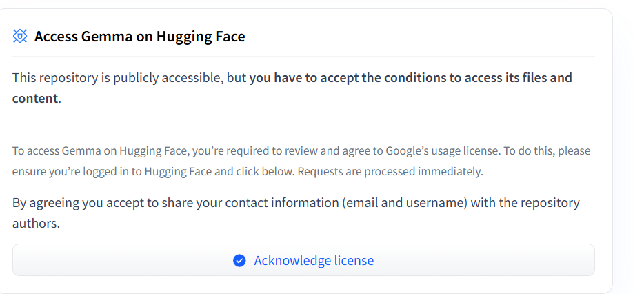
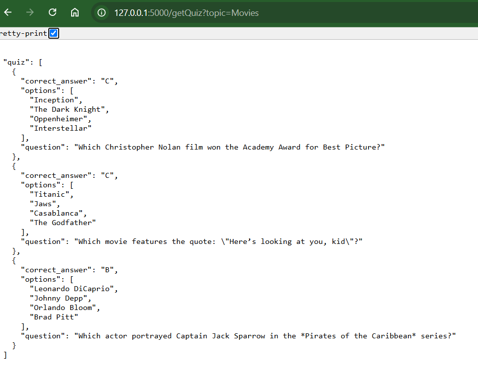
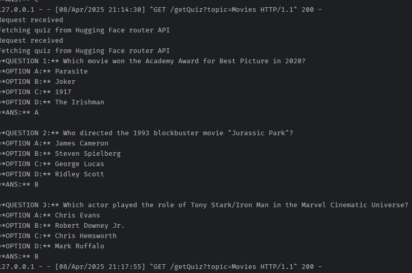

# File Structure:

Four files are there:
## 1. main.py using 
```
API_URL = "https://router.huggingface.co/novita/v3/openai/chat/completions"
HEADERS = {"Authorization": "Bearer YOUR_TOKEN"}
```

## 2. main-inferenceclient.py using 
```
HF_API_TOKEN = os.getenv('HF_API_TOKEN', 'YOUR_TOKEN')  
client = InferenceClient(
    provider="novita",
    api_key=HF_API_TOKEN,
)
```

## 3. main-directModel.py using 
```
from transformers import AutoTokenizer, AutoModelForCausalLM
MODEL = "YOUR MODEL"
tokenizer = AutoTokenizer.from_pretrained(MODEL)
model = AutoModelForCausalLM.from_pretrained(MODEL)
```

## 4. main-pipeline.py using
```
from transformers import pipeline
MODEL = "YOUR MODEL"
pipe = pipeline(
    "text-generation",
    model=MODEL, ..)
```


# Instructions:

## 1. First clone the repo or download to your local folder.
## 2. Run terminal in the project folder.
   - Make sure python is installed. https://www.python.org/downloads/
   - Create Virtual environment using this in terminal: ```python -m venv venv```
   - venv folder will be created.
   - now activate virtual environment
     - For MAC:
        ```source venv/bin/activate```
     - For Windows PS:
       ```.\venv\Scripts\Activate.ps1```
## 3. Now install the libraries
   - ```pip install Flask```
     (source: https://flask.palletsprojects.com/en/stable/installation/)
   - ```pip install requests```
     (source: https://pypi.org/project/requests/)
   - ```pip install transformers```
     (source: https://pypi.org/project/transformers/)
   - ```pip3 install torch torchvision torchaudio --index-url https://download.pytorch.org/whl/cu126```
     (source: https://pytorch.org/get-started/locally/)
## 4. Settings with HuggingFace
   - Signup for Huggingface Account here: https://huggingface.co/
   - Create access token from here: https://huggingface.co/settings/tokens
   - Get Model "google/gemma-3-1b-it" from https://huggingface.co/google/gemma-3-1b-it.
      Acknowledge licence.
   

   - Then run this in terminal:
     ```huggingface-cli login```

   - It will ask for hugging face token, provide and press enter. Then select Y.
     
## 5. To run the code: python main.py (or other file names)

### Outputs:
Check on browser: [http://127.0.0.1:5000/getQuiz?topic=movies](http://127.0.0.1:5000/getQuiz?topic=movies)
Should get something like this:



### Output in terminal:



# Short video showing the above steps (Click the thumbnail below :arrow_down:): 

[](https://www.youtube.com/watch?v=53L9XfusGNA)

# Troubleshooting
1. port 5000 may not be available sometimes, use different post like 5001. Change in android app as well the port number.
2. Make sure to run  "huggingface-cli login" command in terminal and provide token.
3. Make sure to acknowledge licence in the model site such as https://huggingface.co/google/gemma-3-1b-it
4. Select most permissions while creating access token.
5. Try with different models based on quick access. https://huggingface.co/models
6. Use small models.

# Good to know about:
1. Python https://www.python.org/
2. Virtual Environments https://docs.python.org/3/library/venv.html
3. Flask https://flask.palletsprojects.com/en/stable/
4. Huggingface Transformers https://huggingface.co/docs/transformers/en/index

Further references (From Previous)
https://github.com/sit3057082024/T-6.1D

